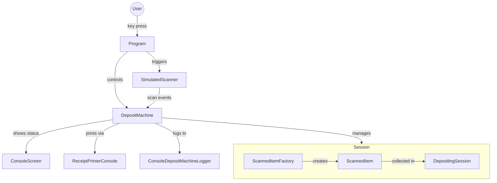

# Reverse Vending Machine

A console application that simulates a reverse vending machine — a device where users deposit empty bottles and cans in exchange for a printed deposit receipt.

## How to Run

```
dotnet run
```

## Controls

| Key | Action |
|-----|--------|
| `C` | Deposit a can (2 kr) |
| `B` | Deposit a bottle (3 kr) |
| `P` | Print receipt and end session |
| `R` | Restart the machine |
| `Q` | Quit |

## Project Structure

| File | Responsibility |
|------|---------------|
| `Program.cs` | Entry point; reads keyboard input and drives the machine |
| `DepositMachine.cs` | Core machine logic; subscribes to scanner events and manages sessions |
| `Scanner/SimulatedScanner.cs` | Simulates an async hardware scanner with thread-safe state and events |
| `Factories/ScannedItemFactory.cs` | Creates `ScannedItem` instances with the correct deposit value |
| `Models/ScannedItem.cs` | Immutable record holding an item's type, timestamp, and deposit value |
| `Models/DepositingSession.cs` | Accumulates all scanned items and computes totals for one session |
| `UI/ReceiptPrinterConsole.cs` | Formats and prints the session summary to the console |
| `UI/ConsoleScreen.cs` | Manages all other console UI messages and state displays |
| `Logging/ConsoleDepositMachineLogger.cs` | Simulates async server logging for deposited items and printed receipts |
| `Interfaces/` | Contracts for all major components, enabling loose coupling |

## Architecture

