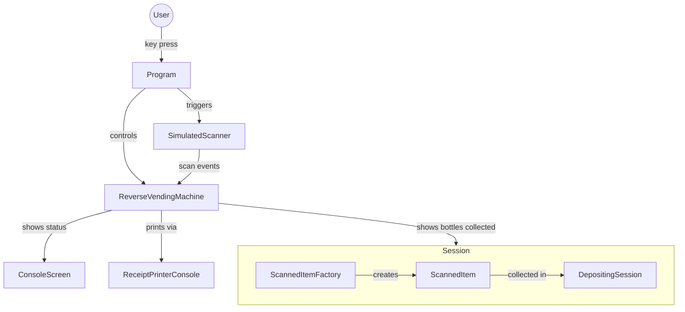

# Reverse Vending Machine

A console application that simulates a reverse vending machine — a device where users deposit empty bottles and cans in exchange for a printed deposit receipt.

## How to Run

```
dotnet run
```

## Controls

| Key | Action |
|-----|--------|
| `C` | Deposit a can 2 kr |
| `B` | Deposit a bottle 3 kr |
| `P` | Print receipt and end session |
| `R` | Restart the machine |
| `Q` | Quit |

## Project Structure

| File | Responsibility |
|------|---------------|
| `Program.cs` | Entry point; reads keyboard input and drives the machine |
| `ReverseVendingMachine.cs` | Core machine logic; subscribes to scanner events and manages sessions |
| `SimulatedScanner.cs` | Simulates an async hardware scanner with state and events |
| `ScannedItemFactory.cs` | Creates `ScannedItem` instances with the correct deposit value |
| `ScannedItem.cs` | Immutable record holding an item's type and deposit value |
| `DepositingSession.cs` | Accumulates all scanned items and computes totals for one session |
| `ReceiptPrinterConsole.cs` | Formats and prints the session summary to the console |
| `ConsoleScreen.cs` | Manages all other console UI messages and state displays |

## Architecture

